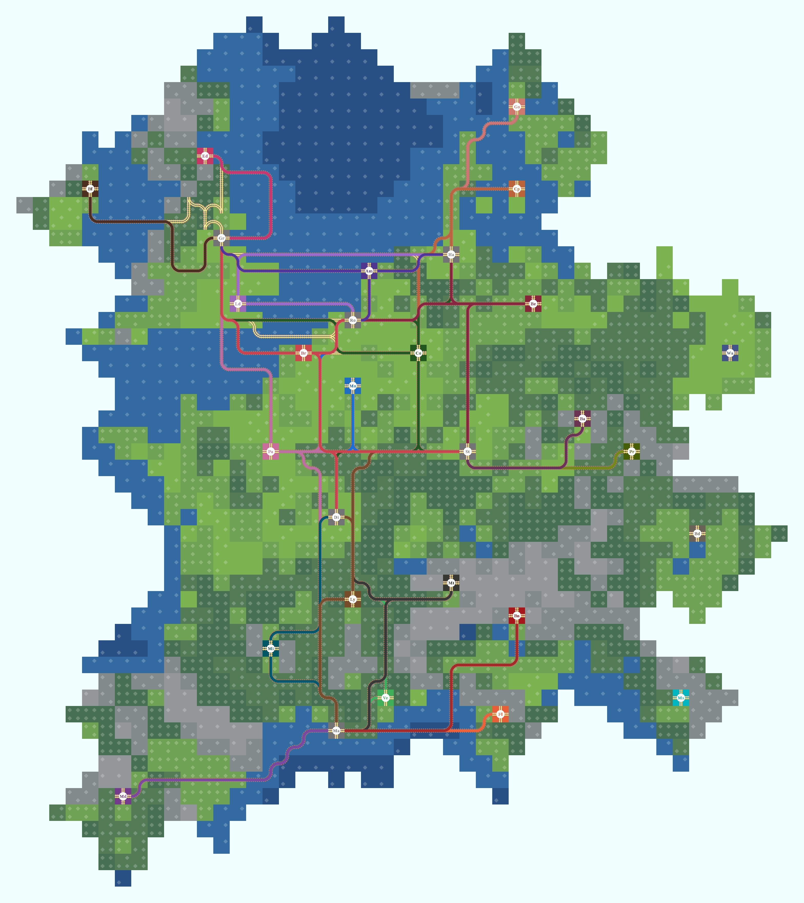

# Train Conductor World Tools

This repository is a collection of tools to help with the creation and validation of manually made track networks for
the Train Conductor World Map.

The tool works by running alongside an open instance of `train-conductor-world.tmx` within [Tiled Map Editor][1]

The required data for the tool, such as the distances, tiles list, and tiled map can be
found [here](https://github.com/ekohilas/train-conductor-world-map).

1. Ensure the required version of Python in `.python-version` is installed.
    * One way this can be done is by running `pyenv install` after [pyenv](https://github.com/pyenv/pyenv#installation)
      is installed.
1. Ensure the requirements are installed.
    * With [Poetry](https://python-poetry.org/docs/#installation), this is achieved through
      running `poetry env use python && poetry install`
    * Alternatively, one can run `python -m pip install .`
1. [Tiled Map Editor][1] can be downloaded [here](https://www.mapeditor.org/download.html).

## Usage

1. Open `train-conductor-world.tmx` in Tiled Map Editor.
1. Run `main.py` e.g.:
    * `poetry run python train_conductor_world_helper/main.py`
    * `python3 train_conductor_world_helper/main.py`
1. Inside Tiled Map Editor, make an edit to the track network and save.
1. Watch as:
    * Within the Tiled Map Editor, the connections between the ports and cities are updated through the annotations
      layer.
    * From the Python output, validations are logged informing you of issues.
1. Repeat.

## Example

## TODO

* Add tests
* Add annotations for shortest bounds
* Improve annotation code, possibly with decorators or context managers.
* Fix pylint import errors in pycharm
* Finalize type annotations

[1]: https://www.mapeditor.org/